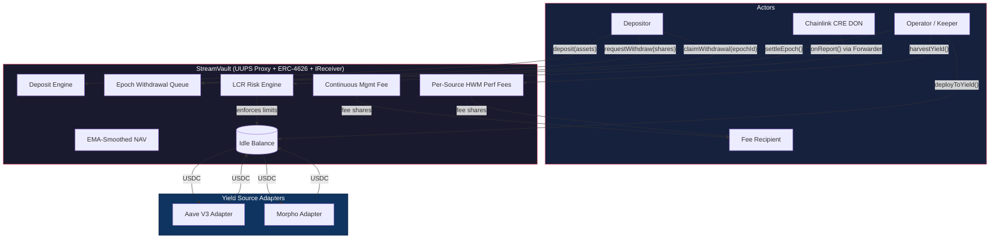
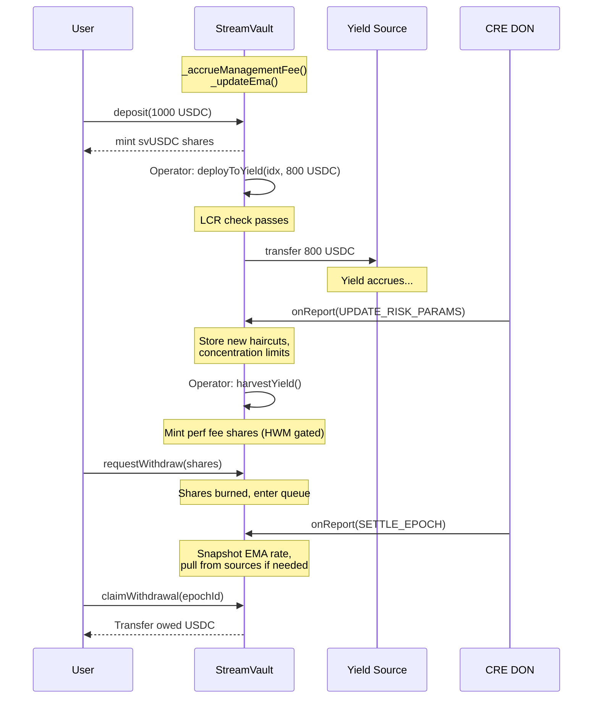

# StreamVault

**An institutional-grade, UUPS-upgradeable ERC-4626 yield aggregator with async epoch-based withdrawals, multi-strategy yield deployment, EMA-smoothed NAV, Basel III-inspired on-chain risk management, and a decentralized risk oracle powered by Chainlink CRE.**

Built with Foundry, OpenZeppelin v5 (+ Upgradeable extensions), and Chainlink CRE SDK. Deployed on Base Sepolia behind an ERC-1967 proxy with real Aave V3 integration.

```
208 tests | 19 test contracts | 6 stateful invariant properties | UUPS Proxy | Live on Base Sepolia
```

---

## Table of Contents

- [The Problem](#the-problem)
- [What StreamVault Does](#what-streamvault-does)
- [Architecture](#architecture)
- [UUPS Upgradeability](#uups-upgradeability)
- [Chainlink CRE Risk Oracle](#chainlink-cre-risk-oracle)
- [Live Testnet Deployment](#live-testnet-deployment-base-sepolia)
- [CRE Simulation Results](#cre-simulation-results)
- [Usage](#usage)
- [Security Model](#security-model)
- [Building & Testing](#building--testing)
- [Project Structure](#project-structure)
- [License](#license)

---

## The Problem

DeFi yield is everywhere — Aave lending pools, Morpho optimizers, liquid staking, RWA vaults — but accessing it as a depositor means choosing one protocol, managing positions manually, and trusting that withdrawals will be instant. In practice, they often aren't: staking exits take days, RWAs settle T+2, and lending pools can hit utilization caps where your funds are temporarily locked.

Most ERC-4626 vaults paper over this by either (a) holding large idle buffers so withdrawals feel instant (costing depositors yield), or (b) blocking withdrawals entirely when liquidity is tight (breaking composability promises). Neither approach is honest.

On top of that, standard vaults are vulnerable to well-known economic attacks:

- **Donation attacks** — an attacker sends tokens directly to the vault to inflate the share price, extracts value at settlement, and dilutes everyone else.
- **MEV on fee events** — bots deposit right before a discrete fee harvest to get shares at pre-fee prices, then exit immediately after. The fee gets socialized across long-term holders.
- **Illusory profit fees** — if one yield source gains while another loses, a naive vault charges performance fees on the gross gain, ignoring the loss. Depositors pay fees on profits that don't exist in aggregate.
- **No risk management** — vaults deploy capital without monitoring protocol health. If Aave utilization spikes to 95% and liquidity dries up, the vault has no way to detect, react, or protect depositors.

---

## What StreamVault Does

StreamVault is an **async yield aggregator with an autonomous risk engine**. It accepts deposits instantly, routes capital across multiple yield protocols through a pluggable connector system, processes withdrawals through a fair epoch-based queue, and enforces risk constraints using a Basel III-inspired Liquidity Coverage Ratio (LCR) model updated by a decentralized Chainlink CRE workflow.

### How Users Interact

**Depositing** is standard ERC-4626. A user approves USDC (or any ERC-20 underlying), calls `deposit()`, and receives vault shares (svUSDC) instantly. Their capital sits idle in the vault until the operator deploys it to yield sources.

**Withdrawing** is a 3-step async process designed around the reality that yield sources can't always return funds instantly:

1. **Request** — the user calls `requestWithdraw(shares)`. Their shares are burned immediately and they enter the current epoch's withdrawal queue. This is irreversible.

2. **Settlement** — the operator (or CRE) calls `settleEpoch()` when ready. The vault snapshots the EMA-smoothed exchange rate, calculates how much USDC each requestor is owed pro-rata, and pulls funds from yield sources if needed (waterfall pattern).

3. **Claim** — the user calls `claimWithdrawal(epochId)` to collect their USDC. Settled epochs persist indefinitely — there's no deadline.

### How Yield Deployment Works

The vault uses a **multi-connector architecture**. Each yield source is a separate adapter contract implementing the `IYieldSource` interface. The vault supports up to 20 connectors simultaneously.

```
User deposits USDC --> Vault (idle balance)
                         |
            Operator calls deployToYield()
                         |
              +----------+----------+
              v          v          v
           Aave V3    Morpho    Source N
          (lending)  (optimized  (any
                      lending)   IYieldSource)
              |          |          |
              +----------+----------+
                         |
            Yield accrues over time
                         |
            Operator calls harvestYield()
              -> measures profit per source
              -> mints performance fee shares
              -> updates high water marks
                         |
        CRE monitors health, updates risk params
              -> LCR enforced on deployToYield()
              -> defensive rebalance if needed
```

Ships with three adapters:

- **Aave V3** — supplies underlying to the Aave Pool, tracks balance via rebasing aToken
- **MetaMorpho** — deposits into ERC-4626 MetaMorpho vaults, tracks balance via share-to-asset conversion
- **MockYieldSource** — configurable-rate simulator for testing

### What Makes This Different

Six mechanisms run under the hood:

**1. EMA-Smoothed NAV** — Settlement doesn't use spot `totalAssets()`. It uses an exponential moving average that converges over a configurable smoothing period (default 1 hour). A one-block donation barely moves the EMA. An attacker would need to sustain the manipulation for the full smoothing period.

```
ema += (spot - ema) * elapsed / smoothingPeriod
```

**2. Continuous Management Fee** — Instead of charging fees at discrete harvest events (creating front-runnable MEV), the vault accrues management fees continuously via time-proportional share dilution on every interaction. There's no discrete event to front-run.

**3. Per-Source High Water Mark Performance Fees** — Each yield source has its own high water mark. Fees are only charged when a source exceeds its previous peak balance. No double-charging on recovery.

**4. Minimum Epoch Duration** — Epochs must be open for at least 5 minutes before settlement. Prevents operator timing attacks on EMA lag.

**5. On-Chain LCR Risk Model** — A Basel III-inspired Liquidity Coverage Ratio model enforces risk constraints on capital deployment. The CRE risk oracle updates haircuts, concentration limits, and risk tiers in real-time.

**6. UUPS Upgradeable Proxy** — The vault is deployed behind an ERC-1967 proxy using the UUPS (ERC-1822) pattern. The operator can upgrade the implementation logic without changing the proxy address or losing state. Storage gaps and ERC-7201 namespaced storage ensure safe upgrades.

---

## Architecture

### System Overview



### Capital Flow



### Contracts

| Contract | Description |
| -------- | ----------- |
| `StreamVault.sol` | Core vault — UUPS-upgradeable ERC-4626 + IReceiver, epoch queue, EMA, fees, LCR, drawdown protection, 2-step operator transfer |
| `IYieldSource.sol` | Interface for yield connectors: `deposit`, `withdraw`, `balance`, `asset` |
| `IReceiver.sol` | Chainlink CRE IReceiver interface for `onReport()` |
| `RiskModel.sol` | Risk parameter structs and LCR computation library |
| `AaveV3YieldSource.sol` | Aave V3 Pool adapter with utilization and liquidity views |
| `MorphoYieldSource.sol` | MetaMorpho ERC-4626 vault adapter with market utilization views |
| `ChainlinkOracle.sol` | Chainlink price feed adapter with decimal normalization |

---

## UUPS Upgradeability

StreamVault uses the **UUPS (Universal Upgradeable Proxy Standard, ERC-1822)** pattern via OpenZeppelin's `UUPSUpgradeable` and `ERC1967Proxy`. This allows the operator to upgrade the vault logic without changing the proxy address or losing any state.

### How It Works

```text
User ──> ERC1967Proxy (state) ──delegatecall──> Implementation (logic)
              │                                       │
              │  upgradeToAndCall(newImpl)             │
              │──────────────────────────────> New Implementation V2
```

- **Proxy**: Stores all vault state (balances, epochs, EMA, fees, etc.) at a fixed address
- **Implementation**: Contains the business logic. Can be swapped by the operator
- **delegatecall**: Executes implementation code against the proxy's storage

### Upgrade Authorization

Only the operator can authorize upgrades via `_authorizeUpgrade()`:

```solidity
function _authorizeUpgrade(address) internal override onlyOperator {}
```

### Initialization

The vault uses `initialize()` instead of a constructor (constructors run on the implementation, not the proxy):

```solidity
/// @custom:oz-upgrades-unsafe-allow constructor
constructor() {
    _disableInitializers(); // prevents init on the bare implementation
}

function initialize(
    IERC20 _asset, address _operator, address _feeRecipient,
    uint256 _performanceFeeBps, uint256 _managementFeeBps,
    uint256 _smoothingPeriod, string memory _name, string memory _symbol
) external initializer {
    __ERC20_init(_name, _symbol);
    __ERC4626_init(_asset);
    __Pausable_init();
    // ... state initialization
}
```

### Storage Safety

- **Storage gap**: `uint256[50] private __gap` reserves 50 slots for future state variables in upgrades
- **ERC-7201 namespaced storage**: OpenZeppelin v5 uses hash-based storage slots for `ERC4626Upgradeable`, `PausableUpgradeable`, and `ReentrancyGuard`, eliminating storage collision risks
- **Re-initialization protection**: The `initializer` modifier prevents `initialize()` from being called more than once

### Inheritance Chain

```text
StreamVault is
    Initializable,              ← OZ upgradeable: init guard
    ERC4626Upgradeable,         ← OZ upgradeable: vault + ERC-20 (namespaced storage)
    ReentrancyGuard,            ← OZ non-upgradeable: already proxy-safe in v5 (ERC-7201)
    PausableUpgradeable,        ← OZ upgradeable: pause mechanism (namespaced storage)
    UUPSUpgradeable,            ← OZ non-upgradeable: stateless (only provides _authorizeUpgrade)
    IReceiver                   ← Chainlink CRE callback interface
```

### Performing an Upgrade

```solidity
// 1. Deploy new implementation
StreamVaultV2 newImpl = new StreamVaultV2();

// 2. Operator upgrades the proxy (state is preserved)
vault.upgradeToAndCall(address(newImpl), "");

// 3. New logic is live — same address, same state
```

---

## Chainlink CRE Risk Oracle

StreamVault implements a **decentralized risk oracle** powered by Chainlink's Compute Runtime Environment (CRE). This is the same pattern Aave uses with Chaos Labs' Edge Risk Oracles — applied at the vault level.

### How the Feedback Loop Works

```text
Monitor --> Compute --> Report --> Enforce
   |                                  |
   +----------------------------------+
              (every 5 min)
```

1. **Monitor** — The CRE workflow reads on-chain health metrics from Aave V3 (utilization, available liquidity), Morpho (market utilization), and StreamVault (balances, pending withdrawals, current LCR).

2. **Compute** — A three-layer deterministic risk model runs on every DON node:
   - **Layer 1**: Per-source risk scores (0-10000) based on utilization, liquidity ratio, oracle deviation, and concentration
   - **Layer 2**: Stressed LCR simulation with Basel III-inspired haircuts and 30% redemption stress scenario
   - **Layer 3**: Action decision engine with threshold-based escalation

3. **Report** — The DON reaches BFT consensus on the risk assessment, signs a report, and the `KeystoneForwarder` delivers it to `vault.onReport()`.

4. **Enforce** — The vault stores updated risk parameters and uses them as hard constraints in `deployToYield()`. The LCR floor prevents over-deployment.

### Risk Parameters

Each yield source has CRE-updated risk parameters:

```solidity
struct SourceRiskParams {
    uint16 liquidityHaircutBps;     // Haircut in LCR calc (0-10000)
    uint16 stressOutflowBps;        // Expected stress outflow (0-10000)
    uint16 maxConcentrationBps;     // Max % of TVL deployable (0-10000)
    uint64 lastUpdated;             // Timestamp of last CRE update
    uint8  riskTier;                // 0=GREEN, 1=YELLOW, 2=ORANGE, 3=RED
}
```

### LCR Computation

The on-chain Liquidity Coverage Ratio:

```text
HQLA = sum(sourceBalance * (10000 - haircutBps) / 10000) + idleBalance
Outflows = sum(sourceBalance * stressOutflowBps / 10000) + pendingWithdrawals
LCR = HQLA * 10000 / Outflows
```

Any `deployToYield()` that would drop the LCR below the configured floor (e.g., 120%) reverts with `LCRBreached`.

### Action Types

| Action | Trigger Condition | Effect |
| ------ | ----------------- | ------ |
| `UPDATE_PARAMS` | Every run (LCR > 150%) | Updates haircuts, concentration limits, risk snapshot |
| `REBALANCE` | LCR between 100-120% | Pulls capital from riskiest source back to idle |
| `EMERGENCY_PAUSE` | LCR below 100% | Pauses vault deposits |
| `SETTLE_EPOCH` | Epoch ready | Triggers epoch settlement |
| `HARVEST_YIELD` | Yield available | Harvests from specified sources |

### CRE Workflow Architecture

```text
cre/
  project.yaml                     # CRE project config (targets, RPCs)
  risk-monitor-workflow/
    main.ts                        # Entry point: cron trigger -> risk check -> report
    risk-model.ts                  # Pure function: metrics -> scores -> action (no SDK deps)
    protocol-readers.ts            # EVMClient.callContract() readers for Aave/Morpho/Vault
    config.json                    # Contract addresses, chain selector, schedule
    workflow.yaml                  # Workflow targets and artifact paths
```

---

## Live Testnet Deployment (Base Sepolia)

The full StreamVault system is deployed on **Base Sepolia** (chain ID 84532) behind a **UUPS proxy (ERC-1967)** with real Aave V3 integration and a mock ERC-4626 vault as a Morpho stand-in (Morpho has no Base Sepolia deployment).

### Deployed Contracts

| Contract | Address | BaseScan |
| -------- | ------- | -------- |
| **StreamVault Proxy** | `0xfef5a1dF7BE97614d0a744ddE2333A8CD7d8Bf16` | [View](https://sepolia.basescan.org/address/0xfef5a1dF7BE97614d0a744ddE2333A8CD7d8Bf16) |
| **StreamVault Implementation** | `0x75d7BEE9Ee294BBeDfE1e307b69F41051838F32f` | [View](https://sepolia.basescan.org/address/0x75d7BEE9Ee294BBeDfE1e307b69F41051838F32f) |
| **AaveV3YieldSource** | `0xA482Cc7eA5C91AF4c219E0Fb898aFbe3Ad66Ba99` | [View](https://sepolia.basescan.org/address/0xA482Cc7eA5C91AF4c219E0Fb898aFbe3Ad66Ba99) |
| **MockERC4626Vault** (Morpho stand-in) | `0x46E3F1C4729444e9b105b293E2F332FA6f692415` | [View](https://sepolia.basescan.org/address/0x46E3F1C4729444e9b105b293E2F332FA6f692415) |
| **MorphoYieldSource** | `0x343bF9575518b91D398fb1d776804004Aa82aA7e` | [View](https://sepolia.basescan.org/address/0x343bF9575518b91D398fb1d776804004Aa82aA7e) |

### External Contracts Used

| Contract | Address |
| -------- | ------- |
| USDC (Base Sepolia) | `0xba50Cd2A20f6DA35D788639E581bca8d0B5d4D5f` |
| Aave V3 Pool | `0x8bAB6d1b75f19e9eD9fCe8b9BD338844fF79aE27` |
| Aave aUSDC | `0x10F1A9D11CDf50041f3f8cB7191CBE2f31750ACC` |
| CRE Forwarder | `0x82300bd7c3958625581cc2f77bc6464dcecdf3e5` |

### Deployment Transactions (UUPS Proxy)

| Step | Transaction |
| ---- | ----------- |
| Deploy StreamVault Implementation | [`0xd7df2a70...`](https://sepolia.basescan.org/tx/0xd7df2a708e6a1fc6e99a4158dab0b6a78ade89287529f2b033ab4c4dec79ccfe) |
| Deploy ERC1967Proxy (+ initialize) | [`0x1b4c5add...`](https://sepolia.basescan.org/tx/0x1b4c5add32ebf0c0920962b934d909f5f46d9d313cd3f4f4ca6b7e92e642b9db) |
| Deploy AaveV3YieldSource | [`0x22a0a236...`](https://sepolia.basescan.org/tx/0x22a0a236562f7482c693abc0336e6a09816961cd448a9af37f8e34f4674824a3) |
| Deploy MockERC4626Vault | [`0x6fe60650...`](https://sepolia.basescan.org/tx/0x6fe606505a3bf7fb58b9fd71f0c913247eff2e6cb1b3bb95d82af02c9bdbf188) |
| Deploy MorphoYieldSource | [`0xdf7b03ae...`](https://sepolia.basescan.org/tx/0xdf7b03aeb4ca1a67e858b29a43111e09750c4898d125202fb1cad1e777cdc0c6) |
| Register Aave source | [`0xcc45930a...`](https://sepolia.basescan.org/tx/0xcc45930a5d8472a412ddc65d0b434019643254c7982d6311ebc49fcea2a6889a) |
| Register Morpho source | [`0xff0a516e...`](https://sepolia.basescan.org/tx/0xff0a516eb5a390aa75bfcf44f1779e69652f8083fa02cb0207cb679467c10833) |
| Set CRE Forwarder | [`0x8ddafdd5...`](https://sepolia.basescan.org/tx/0x8ddafdd57ba9595a0f8443e23ec9268592e92e81f0ff7a88fd94ca5ea96ace9c) |
| Set LCR Floor (120%) | [`0x12d91170...`](https://sepolia.basescan.org/tx/0x12d911709a9f1f723e809ebf7f295c2af1116585b34665a0379cb03527c838ef) |

### End-to-End Demo Transactions

The E2E demo exercised the full vault lifecycle on-chain:

| Phase | Action | Transaction |
| ----- | ------ | ----------- |
| A | Approve USDC | [`0x626165ae...`](https://sepolia.basescan.org/tx/0x626165ae72e5e087b498b2025f1a66058ee87de70bf6ccc5c164fce5fb383af4) |
| A | Deposit 10,000 USDC | [`0x6836316f...`](https://sepolia.basescan.org/tx/0x6836316f9059be554d40c30b4e0d39a20a49ad8e35bfda171775b1aa31a116a5) |
| B | Deploy 4,000 USDC to Aave | [`0xce6875b9...`](https://sepolia.basescan.org/tx/0xce6875b9d14c0f50894ad360cea9c473d597800691380863ed33bb48bcc1e33e) |
| B | Deploy 3,000 USDC to Morpho | [`0xadf6c8fc...`](https://sepolia.basescan.org/tx/0xadf6c8fc33411de2c86f74e448d654088cd4007257b4f539579ded7e5dad468c) |
| C | CRE risk param update via `onReport()` | [`0x8d436221...`](https://sepolia.basescan.org/tx/0x8d436221710e28448bb8f79ed994351bbff5a4ea348e1a9b06ec55194af74243) |
| E | Defensive rebalance via `onReport()` | [`0xdeca6409...`](https://sepolia.basescan.org/tx/0xdeca64094b1bee5341d950abccb481511aaa8733a2476808fdb97468a24a4aa8) |
| F | Request withdrawal (2,000 shares) | [`0xea6553d8...`](https://sepolia.basescan.org/tx/0xea6553d84b164a8b020560f9bf8cf5cb053b012c610db426cc23cebc210766ba) |

### Verified On-Chain Features

After deployment, the following features were individually verified on the live testnet:

| Feature | Status | Verification |
| ------- | ------ | ----------- |
| ERC-4626 deposit/mint | Verified | 1000 USDC deposited, shares minted at correct NAV |
| Multi-source yield deployment | Verified | Capital deployed to Aave (real yield accruing) and Morpho mock |
| EMA-smoothed NAV | Verified | EMA converging correctly after time warp |
| Continuous management fee | Verified | Fee shares minting proportional to time elapsed |
| Per-source HWM performance fee | Verified | `harvestYield()` succeeded, HWM set to real NAV (~1e15 for USDC) |
| Drawdown circuit breaker | Verified | Fixed HWM initialization bug (was 1e18, now 0 for safe auto-detection) |
| CRE `onReport()` risk params | Verified | Risk params stored, LCR updated to 92500 bps |
| Concentration limit enforcement | Verified | `deployToYield()` respects `maxConcentrationBps` |
| LCR floor enforcement | Verified | Over-deployment blocked when LCR would breach floor |
| Defensive rebalance | Verified | Capital pulled from Aave back to idle via `onReport()` |
| Epoch withdrawal lifecycle | Verified | request -> settle (after 5 min) -> claim completed |
| Real Aave yield | Verified | aToken balance grew by +396 wei in live pool |

---

## CRE Simulation Results

The CRE risk monitor workflow was simulated using `cre workflow simulate` against the **live UUPS proxy deployment** on Base Sepolia. The simulation reads real on-chain state through the proxy, runs the full risk model, generates a DON-signed report, and simulates the write transaction.

### Simulation Output

```
[SIMULATION] Running trigger trigger=cron-trigger@1.0.0

[USER LOG] CRE Risk Monitor: Starting health check
[USER LOG]   Execution time: 2026-02-03T15:10:58.401Z

[USER LOG] [Step 1] Reading protocol health metrics...
  -- 10 on-chain reads via EVMClient (DON consensus) --
  Aave utilization: 3312 bps        (33.12% -- real Base Sepolia Aave pool)
  Aave liquidity:   5,000,000,177   (5000 USDC available in pool)
  Morpho utilization: 0 bps         (mock vault, no utilization)
  Morpho liquidity:   3,000,000,000 (3000 USDC in mock vault)
  Vault TVL:          10,000,000,177 (10,000 USDC total assets)
  Aave balance:       5,000,000,177 (5000 USDC deployed + yield accrued)
  Morpho balance:     3,000,000,000 (3000 USDC deployed)
  Idle balance:       2,000,000,000 (2000 USDC in vault)
  Pending withdrawals: 0

[USER LOG] [Step 2] Computing risk model...
  Aave risk score:   3822/10000     (moderate -- 33% utilization, 50% concentration)
  Morpho risk score: 3449/10000     (moderate -- 30% concentration)
  Stressed LCR:      29333 bps      (293% -- well above 120% floor)
  System status:     GREEN
  Decided action:    UPDATE_PARAMS
  New params:
    Aave haircut:         1500 bps  (15%)
    Aave concentration:   6000 bps  (60% max)
    Morpho haircut:       1500 bps  (15%)
    Morpho concentration: 6000 bps  (60% max)

[USER LOG] [Step 3] Generating DON-signed report for: UPDATE_PARAMS
  -- consensus@1.0.0-alpha COMPLETED --

[USER LOG] [Step 4] Submitting report to vault via KeystoneForwarder...
  Target: 0xfef5a1dF7BE97614d0a744ddE2333A8CD7d8Bf16 (proxy)
  -- evm write COMPLETED --

[USER LOG] [Complete] Transaction successful!

Workflow Simulation Result: "action_taken"
WorkflowExecutionFinished - Status: SUCCESS
```

### What the Simulation Proves

1. **UUPS proxy is transparent to CRE** — The workflow reads and writes through the proxy address identically to a non-proxied contract. All 10 on-chain reads (vault state, Aave utilization, source balances) returned correct data via `delegatecall`.

2. **Risk model produces correct outputs** — Aave at 33% utilization and 50% concentration scored 3822/10000 (moderate). Morpho at 30% concentration scored 3449/10000. The stressed LCR of 293% is well above the 120% floor, correctly yielding GREEN status.

3. **Report generation works** — The DON consensus and ECDSA signing completed successfully, producing a valid report payload.

4. **Write path works through proxy** — The simulated `writeReport()` to the proxy address completed, demonstrating the full Forwarder -> Proxy -> `onReport()` delegatecall path.

5. **Deterministic execution** — The workflow compiled to WASM (0.61 MB), ran identically across the simulated node, and produced consistent results.

### Deployment Status

The CRE workflow is **simulation-validated** and ready for live DON deployment. Live deployment requires CRE early access approval (requested at [cre.chain.link/request-access](https://cre.chain.link/request-access)). Once approved:

```bash
cd cre
cre account link-key --owner-label "streamvault-deployer"
cre workflow deploy risk-monitor-workflow -T staging-settings
```

The workflow will then run every 5 minutes on the Chainlink DON, autonomously monitoring vault health and updating risk parameters.

---

## Usage

### Deploying the Vault (UUPS Proxy)

```solidity
// 1. Deploy implementation (constructor disables initializers)
StreamVault implementation = new StreamVault();

// 2. Encode initialize calldata
bytes memory initData = abi.encodeCall(
    StreamVault.initialize,
    (
        IERC20(usdcAddress),       // underlying asset (e.g. USDC)
        operatorAddress,           // trusted operator
        feeRecipientAddress,       // receives fee shares
        1000,                      // 10% performance fee (bps)
        200,                       // 2% annual management fee (bps)
        3600,                      // 1-hour EMA smoothing period (seconds)
        "StreamVault USDC",        // ERC-20 name
        "svUSDC"                   // ERC-20 symbol
    )
);

// 3. Deploy proxy — this calls initialize() on the proxy's storage
ERC1967Proxy proxy = new ERC1967Proxy(address(implementation), initData);
StreamVault vault = StreamVault(address(proxy));
```

### User Flow: Depositing

```solidity
usdc.approve(address(vault), 1000e6);
uint256 shares = vault.deposit(1000e6, msg.sender);
```

### User Flow: Withdrawing (3-Step Async)

```solidity
// Step 1: Request — burns shares, enters epoch queue
vault.requestWithdraw(shares);

// Step 2: Settlement — operator or CRE settles the epoch
vault.settleEpoch();

// Step 3: Claim — user collects USDC
vault.claimWithdrawal(epochId);

// Batch claim across multiple epochs
vault.batchClaimWithdrawals(epochIds);
```

### Operator Flow: Capital Deployment

```solidity
// Register yield sources
vault.addYieldSource(IYieldSource(aaveAdapter));
vault.addYieldSource(IYieldSource(morphoAdapter));

// Deploy idle capital (LCR + concentration limits enforced)
vault.deployToYield(0, 500_000e6);

// Pull capital back to idle
vault.withdrawFromYield(0, 200_000e6);

// Harvest yield (mints perf fee shares, HWM gated)
vault.harvestYield();
```

### CRE Integration Setup

```solidity
// Set the Chainlink KeystoneForwarder address
vault.setChainlinkForwarder(forwarderAddress);

// Set minimum LCR (e.g., 120%)
vault.setLCRFloor(12000);
```

### View Functions

```solidity
vault.totalAssets();                    // Total vault value
vault.idleBalance();                    // Available for deployment
vault.getSourceBalance(source);         // Balance in a yield source
vault.getYieldSources();                // All registered sources
vault.computeLCR();                     // Current Liquidity Coverage Ratio
vault.getSourceRiskParams(source);      // CRE-updated risk parameters
vault.getLatestRiskSnapshot();          // Latest risk assessment
vault.getPendingEpochWithdrawals();     // Pending withdrawal amount
vault.getEpochInfo(epochId);            // Epoch status and amounts
vault.getUserWithdrawRequest(epoch, user); // User's claim info
```

### Admin Functions

```solidity
// 2-step operator transfer (prevents accidental transfers)
vault.transferOperator(newOperator);     // Step 1: propose
// newOperator calls:
vault.acceptOperator();                  // Step 2: accept

vault.setFeeRecipient(newRecipient);
vault.setManagementFee(100);            // 1% annual
vault.setSmoothingPeriod(7200);         // 2-hour EMA
vault.setMaxDrawdown(1500);             // 15% circuit breaker
vault.pause();                          // Emergency pause
vault.unpause();                        // Resume

// UUPS upgrade (operator only)
vault.upgradeToAndCall(address(newImpl), "");
```

---

## Security Model

### Access Control

| Role | Capabilities |
| ---- | ----------- |
| **Operator** | Deploy/withdraw capital, settle epochs, harvest yield, upgrade implementation (UUPS), 2-step transfer operator, set fee recipient, CRE forwarder, management fee, smoothing period, drawdown threshold, LCR floor, yield source management, pause/unpause |
| **Pending Operator** | Accept operator role (2-step transfer) |
| **CRE Forwarder** | Call `onReport()` with DON-signed risk updates, rebalances, emergency actions |
| **User** | Deposit, request withdraw, claim from settled epochs |

### Protections

- **UUPS upgradeable proxy** — operator-gated `_authorizeUpgrade()`, storage gap (`__gap[50]`), `_disableInitializers()` on implementation
- **2-step operator transfer** — `transferOperator()` + `acceptOperator()` prevents accidental transfers to wrong addresses
- **Custom errors** — gas-efficient custom errors (`OnlyOperator`, `SyncWithdrawDisabled`, etc.) instead of revert strings
- **ReentrancyGuard** on all state-changing functions (proxy-safe via ERC-7201 namespaced storage)
- **Inflation attack protection** via `_decimalsOffset() = 3` (1e3 virtual shares/assets)
- **Rounding** always floors in favor of the vault (standard ERC-4626 convention)
- **Zero-address checks** on initializer params, admin setters, and adapter constructors
- **ERC-4626 compliance** — `maxDeposit()` / `maxMint()` return 0 when paused per spec
- **Fee caps**: performance fee <= 50%, management fee <= 5% annual
- **Yield source cap**: maximum 20 connectors
- **EMA bounds**: floor at 95% of spot, minimum at virtual offset
- **EMA first-deposit snap**: EMA jumps to spot so early depositors aren't penalized
- **Minimum epoch duration**: 5 minutes prevents operator timing attacks
- **Per-source high water marks**: loss recovery doesn't count as new profit
- **Net-asset fee base**: management fees exclude claimable assets
- **EMA-consistent fee pricing**: fee shares priced via EMA, consistent with settlement
- **`mulDiv` precision** — `navPerShare()` uses OpenZeppelin `mulDiv` to avoid rounding errors
- **Actual-amount transfers**: adapters measure real balance changes, not requested amounts
- **`onlyVault` guards** on all yield source adapters
- **Disabled sync withdrawals**: `withdraw()`, `redeem()` revert with `SyncWithdrawDisabled` — async only
- **LCR enforcement**: `deployToYield()` reverts if LCR would breach floor
- **Concentration limits**: per-source deployment capped by CRE-updated `maxConcentrationBps`
- **Risk param bounds**: haircuts capped at 95%, validated on every CRE update
- **Drawdown circuit breaker**: auto-pause on NAV drop > threshold from HWM
- **Re-initialization protection**: `initializer` modifier prevents double-initialization on proxy

### Emergency Pause

```
Blocked when paused:           Allowed when paused:
  deposit() / mint()             claimWithdrawal()
  requestWithdraw()              batchClaimWithdrawals()
                                 settleEpoch()
                                 All view functions
```

Users can always exit from settled epochs, even when the vault is paused.

---

## Building & Testing

### Build

```shell
forge build
```

### Run Tests

```shell
forge test           # 208 tests across 19 contracts
forge test -vv       # verbose with gas
```

### CRE Workflow Simulation

```shell
cd cre
bun install                      # install CRE SDK
cre workflow simulate risk-monitor-workflow -T local-simulation --trigger-index 0 --non-interactive
```

### Static Analysis

```shell
slither . --filter-paths "lib/,test/" --exclude naming-convention,pragma,solc-version,assembly
```

### Test Suite

208 tests across 19 test contracts covering every feature:

| Test Contract | Tests | Coverage |
| ------------- | ----- | -------- |
| `Constructor_Test` | 8 | Parameter validation, boundary values, zero-address revert (proxy-aware) |
| `Deposit_Test` | 6 | First deposit, EMA snap, proportionality, totalAssets consistency |
| `Withdrawal_Test` | 19 | Full lifecycle, double-claim revert, multi-user pro-rata, disabled sync paths |
| `YieldSource_Test` | 14 | Add/remove, asset mismatch, 20-source cap, waterfall pull |
| `Harvest_Test` | 6 | HWM gating, per-source tracking, loss recovery |
| `EMA_Test` | 7 | Convergence, interpolation, 95% floor, donation resistance |
| `ManagementFee_Test` | 8 | Time-proportional accrual, ~2% dilution, net-asset base |
| `Admin_Test` | 12 | 2-step operator transfer, access control guards, zero-address reverts |
| `Upgrade_Test` | 5 | UUPS upgrade authorization, state preservation, re-initialization prevention, implementation lock |
| `Invariant_Test` | 6 | `totalAssets == idle + deployed - claimable`, roundtrip, inflation |
| `Fuzz_Test` | 6 | Fuzzed deposit/withdraw roundtrip, EMA floor, fee proportionality |
| `StatefulInvariant_Test` | 6 | Foundry invariant testing: 8 entry points, 5 actors, 128k calls, 6 properties |
| `Reentrancy_Test` | 2 | Malicious ERC-20 callback attacks blocked by ReentrancyGuard |
| `ERC4626Compliance_Test` | 21 | Full ERC-4626 spec: convertTo\*, max\*, preview\*, fuzzed monotonicity |
| `ViewAndBatch_Test` | 9 | View functions, batch claims, claimable exclusion |
| `Pause_Test` | 13 | Pause/unpause, blocked operations, allowed exits, maxDeposit/maxMint return 0 |
| `Drawdown_Test` | 13 | Circuit breaker, HWM updates, threshold config |
| `ChainlinkOracle_Test` | 16 | Price normalization (6/8/18 dec), staleness, fuzz tests |
| `StreamVaultCRE_Test` | 31 | Forwarder config, `onReport()` access control, all 5 actions, LCR enforcement, concentration limits, full integration cycle, backwards compatibility |

### Test Design Patterns

- **Abstract base harness** (`StreamVaultTestBase`) with shared helpers
- **One contract per feature area** — self-documenting in forge output
- **True stateful invariant testing** — `VaultHandler` with random sequences across 5 actors
- **Reentrancy proof** via custom `ReentrantERC20`
- **ERC-4626 conformance** — 21 tests covering every MUST/SHOULD in the spec
- **`vm.expectRevert(Selector)`** for exact custom error testing

---

## Project Structure

```text
o-vault/
  src/
    StreamVault.sol              # Core vault (UUPS + ERC-4626 + IReceiver + LCR)
    AaveV3YieldSource.sol        # Aave V3 Pool adapter
    MorphoYieldSource.sol        # MetaMorpho ERC-4626 adapter
    ChainlinkOracle.sol          # Chainlink price feed adapter
    MockYieldSource.sol          # Configurable-rate mock for testing
    interfaces/
      IYieldSource.sol           # Yield source connector interface
      IReceiver.sol              # Chainlink CRE IReceiver
      IPriceOracle.sol           # Price oracle interface
    libraries/
      RiskModel.sol              # Risk param structs + LCR logic
  test/
    StreamVault.t.sol            # Core tests (constructor, deposit, withdraw, yield, fees, upgrade, etc.)
    StreamVaultAdvanced.t.sol    # Invariant, fuzz, reentrancy, ERC-4626 compliance, pause, drawdown
    StreamVaultCRE.t.sol         # CRE integration tests (31 tests)
    ChainlinkOracle.t.sol        # Oracle adapter tests
    mocks/
      MockERC20.sol              # Test token
  script/
    Deploy.s.sol                 # Generic UUPS proxy deployment
    DeployBaseSepolia.s.sol      # Base Sepolia proxy deployment
    DemoE2E.s.sol                # End-to-end demo script
    mocks/
      MockERC4626Vault.sol       # Morpho stand-in for testnet
  cre/
    project.yaml                 # CRE project config
    risk-monitor-workflow/
      main.ts                    # Workflow entry point
      risk-model.ts              # Pure risk computation (no SDK deps)
      protocol-readers.ts        # EVMClient readers
      config.json                # Deployed contract addresses
      workflow.yaml              # Workflow targets
  lib/
    forge-std/
    openzeppelin-contracts/               # OZ v5.5.0
    openzeppelin-contracts-upgradeable/   # OZ Upgradeable v5.5.0
  remappings.txt                 # IDE remappings for Solidity extension
```

---

## Reproducing the Deployment

```bash
# 1. Clone and install
git clone <repo-url> && cd o-vault
forge install

# 2. Set up .env
cp .env.example .env
# Add PRIVATE_KEY, BASE_SEPOLIA_RPC_URL

# 3. Fund wallet
# ETH: https://www.alchemy.com/faucets/base-sepolia
# USDC: https://staging.aave.com/faucet/ (Base Sepolia, USDC)

# 4. Deploy contracts
source .env
forge script script/DeployBaseSepolia.s.sol --rpc-url base_sepolia --broadcast

# 5. Update .env with deployed addresses, run E2E demo
forge script script/DemoE2E.s.sol --rpc-url base_sepolia --broadcast

# 6. Simulate CRE workflow against deployed contracts
cd cre && bun install
cre workflow simulate risk-monitor-workflow -T local-simulation --trigger-index 0 --non-interactive
```

---

## License

MIT
