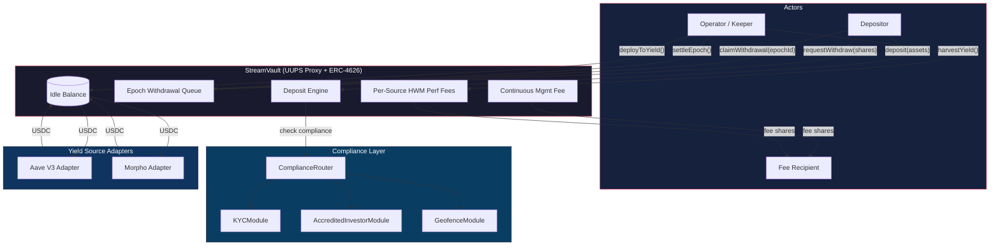
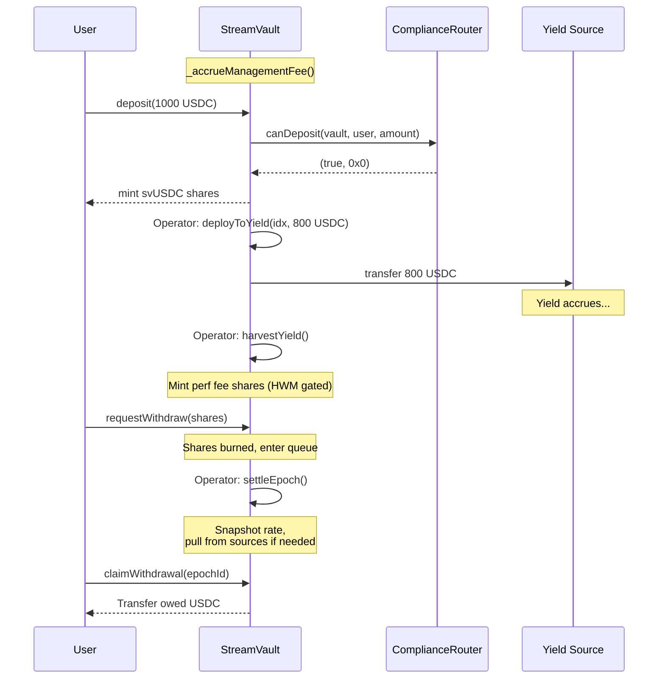

# StreamVault

**A B2B institutional-grade, UUPS-upgradeable ERC-4626 yield aggregator with async epoch-based withdrawals (EIP-7540 compliant), multi-strategy yield deployment, pluggable compliance modules, timelocked governance, and enterprise-ready access controls.**

Built with Foundry, OpenZeppelin v5 (+ Upgradeable extensions). Deployed on Base Sepolia behind an ERC-1967 proxy with real Aave V3 and Morpho Blue integration.

```
322 tests | 31 test contracts | 12 fuzz tests | 35 stateful invariants | UUPS Proxy | EIP-7540 | Compliance Modules | Live on Base Sepolia
```

---

## Table of Contents

- [The Problem](#the-problem)
- [What StreamVault Does](#what-streamvault-does)
- [Architecture](#architecture)
- [Compliance Module System](#compliance-module-system)
- [UUPS Upgradeability](#uups-upgradeability)
- [Live Testnet Deployment](#live-testnet-deployment-base-sepolia)
- [Usage](#usage)
- [Security Model](#security-model)
- [Building & Testing](#building--testing)
- [Project Structure](#project-structure)
- [License](#license)

---

## The Problem

DeFi yield is everywhere — Aave lending pools, Morpho optimizers, liquid staking, RWA vaults — but accessing it as a depositor means choosing one protocol, managing positions manually, and trusting that withdrawals will be instant. In practice, they often aren't: staking exits take days, RWAs settle T+2, and lending pools can hit utilization caps where your funds are temporarily locked.

Most ERC-4626 vaults paper over this by either (a) holding large idle buffers so withdrawals feel instant (costing depositors yield), or (b) blocking withdrawals entirely when liquidity is tight (breaking composability promises). Neither approach is honest.

**For B2B vault infrastructure**, additional challenges arise:

- **No compliance hooks** — institutional clients require KYC verification, accredited investor checks, and geographic restrictions. Standard vaults have no pluggable compliance system.
- **Rigid architecture** — existing solutions are monolithic. Enterprises need modular, upgradeable infrastructure they can customize.
- **Missing operational controls** — no timelocked governance, no role-based access, no transfer restrictions for regulated securities.

---

## What StreamVault Does

StreamVault is an **async yield aggregator with a pluggable compliance system** designed for B2B vault infrastructure. It accepts deposits instantly, routes capital across multiple yield protocols through a pluggable connector system, processes withdrawals through a fair epoch-based queue, and enforces compliance rules through modular on-chain modules.

### How Users Interact

**Depositing** is standard ERC-4626. A user approves USDC (or any ERC-20 underlying), calls `deposit()`, and receives vault shares (svUSDC) instantly. Their capital sits idle in the vault until the operator deploys it to yield sources.

**Withdrawing** is a 3-step async process designed around the reality that yield sources can't always return funds instantly:

1. **Request** — the user calls `requestWithdraw(shares)`. Their shares are burned immediately and they enter the current epoch's withdrawal queue. This is irreversible.

2. **Settlement** — the operator calls `settleEpoch()` when ready. The vault snapshots the exchange rate, calculates how much USDC each requestor is owed pro-rata, and pulls funds from yield sources if needed (waterfall pattern).

3. **Claim** — the user calls `claimWithdrawal(epochId)` to collect their USDC. Settled epochs persist indefinitely — there's no deadline.

### How Yield Deployment Works

The vault uses a **multi-connector architecture**. Each yield source is a separate adapter contract implementing the `IYieldSource` interface. The vault supports up to 20 connectors simultaneously.

```
User deposits USDC --> Vault (idle balance)
                         |
            Operator calls deployToYield()
                         |
              +----------+----------+
              v          v          v
          Aave V3  Morpho Blue  Source N
         (lending)   (direct     (any
                     market)    IYieldSource)
              |          |          |
              +----------+----------+
                         |
            Yield accrues over time
                         |
            Operator calls harvestYield()
              -> measures profit per source
              -> mints performance fee shares
              -> updates high water marks
```

Ships with three adapters:

- **Aave V3** — supplies underlying to the Aave Pool, tracks balance via rebasing aToken
- **Morpho Blue** — supplies directly to a Morpho Blue lending market, tracks balance via supply share conversion with virtual share accounting
- **MockYieldSource** — configurable-rate simulator for testing

### What Makes This Different

**B2B-First Design** with enterprise features:

**1. Pluggable Compliance Modules** — Modular compliance system with router pattern. Supports KYC verification, accredited investor checks, and geographic restrictions. Each vault can enable/disable modules independently.

**2. Continuous Management Fee** — Instead of charging fees at discrete harvest events (creating front-runnable MEV), the vault accrues management fees continuously via time-proportional share dilution on every interaction. There's no discrete event to front-run.

**3. Per-Source High Water Mark Performance Fees** — Each yield source has its own high water mark. Fees are only charged when a source exceeds its previous peak balance. No double-charging on recovery.

**4. Minimum Epoch Duration** — Epochs must be open for at least 5 minutes before settlement. Prevents operator timing attacks.

**5. UUPS Upgradeable Proxy** — The vault is deployed behind an ERC-1967 proxy using the UUPS (ERC-1822) pattern. The operator can upgrade the implementation logic without changing the proxy address or losing state. Storage gaps and ERC-7201 namespaced storage ensure safe upgrades.

**6. Deposit Cap / TVL Limits** — Configurable maximum total assets (`depositCap`). When set, `maxDeposit()` and `maxMint()` respect the cap. Prevents over-concentration and manages strategy capacity.

**7. Withdrawal Fee** — Configurable exit fee (0-1%) charged on claim, transferred to the fee recipient as USDC. Discourages run-on-the-vault behavior.

**8. Deposit Lockup Period** — Configurable lockup (0-7 days) after depositing before shares can be withdrawn. Prevents flash-deposit-before-harvest gaming.

**9. Share Transfer Restrictions** — Optional whitelist mode for ERC-20 share transfers. When enabled, only whitelisted addresses can receive shares. Minting (deposits) and burning (withdrawals) are unrestricted.

**10. Timelocked Governance** — Critical operator actions (fee changes, yield source management, upgrades) can be placed behind a configurable timelock (1 hour - 7 days). Emergency actions (pause/unpause) bypass the timelock. Provides depositors with change-visibility guarantees.

**11. EIP-7540 Async Redeem** — The vault implements `IERC7540Redeem` for standardized async redemptions with operator delegation. `requestRedeem()` allows delegated withdrawal requests, `pendingRedeemRequest()` / `claimableRedeemRequest()` provide request lifecycle queries, and ERC-165 `supportsInterface()` advertises compliance.

**12. Role-Based Access Control (RBAC)** — Lightweight role system with `ROLE_GUARDIAN` for emergency pause/unpause. The operator implicitly has all roles. Additional addresses can be granted specific roles via `grantRole()` / `revokeRole()`, enabling operational separation between day-to-day management and emergency response.

**13. FeeLib** — Fee calculation logic extracted into a pure library (`FeeLib.sol`). Computes performance fees, management fees, withdrawal fees, and share conversion. Improves auditability by isolating fee math from state-mutating vault logic.

**14. Rescuable** — `rescueToken()` allows the operator to recover ERC-20 tokens accidentally sent to the vault. The underlying asset is blocked from rescue to protect depositor funds.

**15. Multicall** — Inherits OpenZeppelin `Multicall` for batching multiple admin calls in a single transaction (e.g., `setDepositCap` + `setWithdrawalFee` + `setLockupPeriod` atomically).

**16. EIP-712 Gasless Operator Approval** — `setOperatorWithSig()` allows relayers to submit EIP-7540 operator approvals on behalf of users without the user paying gas. Uses EIP-712 typed data hashing with per-user nonce replay protection.

**17. Transient Reentrancy Guard** — Uses `ReentrancyGuardTransient` (EIP-1153 transient storage) instead of standard `ReentrancyGuard`. Reduces reentrancy check gas cost from ~2,600 to ~100 gas per call.

---

## Architecture

### System Overview



### Capital Flow



### Contracts

| Contract | Description |
| -------- | ----------- |
| `StreamVault.sol` | Core vault — UUPS-upgradeable ERC-4626 + IERC7540Redeem + EIP712 + Multicall, epoch queue, fees, drawdown protection, timelock, transfer restrictions, deposit cap, lockup, RBAC, rescuable, 2-step operator transfer, compliance integration |
| `FeeLib.sol` | Pure fee calculation library — performance, management, withdrawal fees, share conversion |
| `IYieldSource.sol` | Interface for yield connectors: `deposit`, `withdraw`, `balance`, `asset` |
| `IERC7540.sol` | EIP-7540 Async Redeem + Operator interfaces |
| `AaveV3YieldSource.sol` | Aave V3 Pool adapter with utilization and liquidity views |
| `MorphoBlueYieldSource.sol` | Morpho Blue direct market supply adapter with virtual share accounting |
| `ChainlinkOracle.sol` | Chainlink price feed adapter with decimal normalization |

### Compliance Contracts

| Contract | Description |
| -------- | ----------- |
| `IComplianceModule.sol` | Interface for pluggable compliance checks |
| `IComplianceRouter.sol` | Interface for compliance routing |
| `ComplianceRouter.sol` | Routes compliance checks through multiple modules |
| `KYCModule.sol` | Allowlist-based KYC with tiers, expiry, attesters |
| `AccreditedInvestorModule.sol` | Investor type verification (retail, accredited, qualified, institutional) |
| `GeofenceModule.sol` | Geographic restrictions, sanctions list, OFAC preset |

---

## Compliance Module System

StreamVault features a **pluggable compliance module system** designed for institutional B2B use cases. The system uses a router pattern that chains multiple compliance modules together.

### Architecture

```
User Action (deposit/transfer)
         |
         v
   ComplianceRouter
         |
    +----+----+----+
    |    |    |    |
    v    v    v    v
  KYC  Accred Geo  ...
Module Module Module
    |    |    |
    +----+----+
         |
         v
   All must pass
```

### Compliance Modules

#### KYCModule

Allowlist-based KYC verification with:
- **Tiered KYC levels** (Basic, Enhanced, Institutional)
- **Expiration tracking** with configurable validity periods
- **Authorized attesters** who can set/revoke KYC status
- **Per-vault minimum tier requirements**
- **Batch attestation** for efficiency

```solidity
// Attest KYC for a user
kycModule.attestKYC(user, tier, validityPeriod, providerRef);

// Set minimum tier for a vault
kycModule.setVaultMinTier(vault, 2); // Require Enhanced KYC
```

#### AccreditedInvestorModule

Investor accreditation verification with:
- **Investor types**: Retail, Accredited, Qualified Purchaser, Institutional
- **Per-vault requirements**: minimum type, max investment, investor caps
- **Investment tracking** for limit enforcement
- **Authorized attesters** for accreditation

```solidity
// Attest investor type
accreditedModule.attestInvestorType(user, InvestorType.ACCREDITED, validityPeriod);

// Configure vault requirements
accreditedModule.setVaultRequirements(vault, InvestorType.ACCREDITED, 100_000e6, 10_000_000e6, 100);
```

#### GeofenceModule

Geographic and sanctions compliance with:
- **Country-based restrictions** (global and per-vault)
- **Sanctions list integration** via oracle
- **OFAC preset** for common blocked countries
- **Authorized geo-attesters** for user location verification

```solidity
// Attest user location
geofenceModule.attestCountry(user, countryCode);

// Block countries globally
geofenceModule.setCountryBlocked(countryCode, true);

// Apply OFAC preset
geofenceModule.applyOFACPreset();
```

### Router Configuration

The ComplianceRouter chains modules together:

```solidity
// Deploy router
ComplianceRouter router = new ComplianceRouter(owner);

// Add modules
router.addModule(IComplianceModule(kycModule));
router.addModule(IComplianceModule(accreditedModule));
router.addModule(IComplianceModule(geofenceModule));

// Connect to vault
vault.setComplianceRouter(IComplianceRouter(router));

// Optionally disable specific modules per vault
router.setModuleDisabledForVault(vault, kycModule, true);
```

### Compliance Check Flow

1. User calls `deposit()` on StreamVault
2. StreamVault calls `complianceRouter.canDeposit(vault, user, amount)`
3. Router iterates through all enabled modules
4. Each module returns `(allowed, reason)`
5. If any module returns `allowed=false`, deposit reverts with reason
6. If all pass, deposit proceeds

---

## UUPS Upgradeability

StreamVault uses the **UUPS (Universal Upgradeable Proxy Standard, ERC-1822)** pattern via OpenZeppelin's `UUPSUpgradeable` and `ERC1967Proxy`. This allows the operator to upgrade the vault logic without changing the proxy address or losing any state.

### How It Works

```text
User ──> ERC1967Proxy (state) ──delegatecall──> Implementation (logic)
              │                                       │
              │  upgradeToAndCall(newImpl)             │
              │──────────────────────────────> New Implementation V2
```

- **Proxy**: Stores all vault state (balances, epochs, fees, etc.) at a fixed address
- **Implementation**: Contains the business logic. Can be swapped by the operator
- **delegatecall**: Executes implementation code against the proxy's storage

### Upgrade Authorization

Only the operator can authorize upgrades via `_authorizeUpgrade()`. When a timelock is active, upgrades must be pre-approved via the timelock schedule:

```solidity
function _authorizeUpgrade(address newImplementation) internal override onlyOperator {
    if (timelockDelay > 0) {
        if (newImplementation != _pendingUpgradeImpl) revert TimelockNotScheduled();
        _pendingUpgradeImpl = address(0);
    }
}
```

### Initialization

The vault uses `initialize()` instead of a constructor (constructors run on the implementation, not the proxy):

```solidity
/// @custom:oz-upgrades-unsafe-allow constructor
constructor() {
    _disableInitializers(); // prevents init on the bare implementation
}

function initialize(
    IERC20 _asset, address _operator, address _feeRecipient,
    uint256 _performanceFeeBps, uint256 _managementFeeBps,
    string memory _name, string memory _symbol
) external initializer {
    __ERC20_init(_name, _symbol);
    __ERC4626_init(_asset);
    __Pausable_init();
    // ... state initialization
}
```

### Storage Safety

- **Storage gap**: `uint256[40] private __gap` reserves slots for future state variables in upgrades
- **ERC-7201 namespaced storage**: OpenZeppelin v5 uses hash-based storage slots for `ERC4626Upgradeable`, `PausableUpgradeable`, and `ReentrancyGuard`, eliminating storage collision risks
- **Re-initialization protection**: The `initializer` modifier prevents `initialize()` from being called more than once

### Performing an Upgrade

```solidity
// 1. Deploy new implementation
StreamVaultV2 newImpl = new StreamVaultV2();

// 2. Operator upgrades the proxy (state is preserved)
vault.upgradeToAndCall(address(newImpl), "");

// 3. New logic is live — same address, same state
```

---

## Live Testnet Deployment (Base Sepolia)

The full StreamVault system is deployed on **Base Sepolia** (chain ID 84532) behind a **UUPS proxy (ERC-1967)** with real Aave V3 and Morpho Blue integration.

### Deployed Contracts

| Contract | Address | BaseScan |
| -------- | ------- | -------- |
| **StreamVault Proxy** | `0xfe5FE166E70a2772B6d6cA98A9432925088620A5` | [View](https://sepolia.basescan.org/address/0xfe5FE166E70a2772B6d6cA98A9432925088620A5) |
| **StreamVault Implementation** | `0x8b7FC39315d47177486b548ECdeface12674dFc9` | [View](https://sepolia.basescan.org/address/0x8b7FC39315d47177486b548ECdeface12674dFc9) |
| **AaveV3YieldSource** | `0x0724eafD693c2c7F07fafa321b1bF75D2572f190` | [View](https://sepolia.basescan.org/address/0x0724eafD693c2c7F07fafa321b1bF75D2572f190) |
| **MorphoBlueYieldSource** | `0x9197eC25246b992797C4DADc479874Cb0c473AeD` | [View](https://sepolia.basescan.org/address/0x9197eC25246b992797C4DADc479874Cb0c473AeD) |

### External Contracts Used

| Contract | Address |
| -------- | ------- |
| USDC (Base Sepolia) | `0xba50Cd2A20f6DA35D788639E581bca8d0B5d4D5f` |
| Aave V3 Pool | `0x8bAB6d1b75f19e9eD9fCe8b9BD338844fF79aE27` |
| Aave aUSDC | `0x10F1A9D11CDf50041f3f8cB7191CBE2f31750ACC` |
| Morpho Blue Core | `0xBBBBBbbBBb9cC5e90e3b3Af64bdAF62C37EEFFCb` |

---

## Usage

### Deploying the Vault (UUPS Proxy)

```solidity
// 1. Deploy implementation (constructor disables initializers)
StreamVault implementation = new StreamVault();

// 2. Encode initialize calldata
bytes memory initData = abi.encodeCall(
    StreamVault.initialize,
    (
        IERC20(usdcAddress),       // underlying asset (e.g. USDC)
        operatorAddress,           // trusted operator
        feeRecipientAddress,       // receives fee shares
        1000,                      // 10% performance fee (bps)
        200,                       // 2% annual management fee (bps)
        "StreamVault USDC",        // ERC-20 name
        "svUSDC"                   // ERC-20 symbol
    )
);

// 3. Deploy proxy — this calls initialize() on the proxy's storage
ERC1967Proxy proxy = new ERC1967Proxy(address(implementation), initData);
StreamVault vault = StreamVault(address(proxy));
```

### User Flow: Depositing

```solidity
usdc.approve(address(vault), 1000e6);
uint256 shares = vault.deposit(1000e6, msg.sender);
```

### User Flow: Withdrawing (3-Step Async)

```solidity
// Step 1: Request — burns shares, enters epoch queue
vault.requestWithdraw(shares);

// Step 2: Settlement — operator settles the epoch
vault.settleEpoch();

// Step 3: Claim — user collects USDC
vault.claimWithdrawal(epochId);

// Batch claim across multiple epochs
vault.batchClaimWithdrawals(epochIds);
```

### Operator Flow: Capital Deployment

```solidity
// Register yield sources
vault.addYieldSource(IYieldSource(aaveAdapter));
vault.addYieldSource(IYieldSource(morphoAdapter));

// Deploy idle capital
vault.deployToYield(0, 500_000e6);

// Pull capital back to idle
vault.withdrawFromYield(0, 200_000e6);

// Harvest yield (mints perf fee shares, HWM gated)
vault.harvestYield();
```

### Compliance Setup

```solidity
// Deploy compliance modules
KYCModule kycModule = new KYCModule(owner);
AccreditedInvestorModule accreditedModule = new AccreditedInvestorModule(owner);
GeofenceModule geofenceModule = new GeofenceModule(owner);

// Deploy and configure router
ComplianceRouter router = new ComplianceRouter(owner);
router.addModule(IComplianceModule(kycModule));
router.addModule(IComplianceModule(accreditedModule));
router.addModule(IComplianceModule(geofenceModule));

// Connect to vault
vault.setComplianceRouter(IComplianceRouter(router));

// Configure KYC requirements
kycModule.setVaultMinTier(address(vault), 1); // Require basic KYC
kycModule.setAttester(attesterAddress, true);

// Attest users
kycModule.attestKYC(userAddress, 1, 365 days, bytes32(0));
```

### View Functions

```solidity
vault.totalAssets();                    // Total vault value
vault.idleBalance();                    // Available for deployment
vault.getSourceBalance(idx);            // Balance in a yield source
vault.getYieldSources();                // All registered sources
vault.getPendingEpochWithdrawals();     // Pending withdrawal amount
vault.getEpochInfo(epochId);            // Epoch status and amounts
vault.getUserWithdrawRequest(epoch, user); // User's claim info
```

### Admin Functions

```solidity
// 2-step operator transfer (prevents accidental transfers)
vault.transferOperator(newOperator);     // Step 1: propose
// newOperator calls:
vault.acceptOperator();                  // Step 2: accept

vault.setFeeRecipient(newRecipient);
vault.setManagementFee(100);            // 1% annual
vault.setMaxDrawdown(1500);             // 15% circuit breaker
vault.pause();                          // Emergency pause
vault.unpause();                        // Resume

// UUPS upgrade (operator only)
vault.upgradeToAndCall(address(newImpl), "");
```

### Deposit Cap & Lockup

```solidity
// Set TVL cap (0 = unlimited)
vault.setDepositCap(10_000_000e6);   // 10M USDC max TVL

// Set lockup period (0 = disabled, max 7 days)
vault.setLockupPeriod(1 days);       // 1-day lockup after deposit

// maxDeposit() automatically respects the cap
uint256 remaining = vault.maxDeposit(msg.sender);
```

### Withdrawal Fee

```solidity
// Set exit fee (0-100 bps, i.e. 0-1%)
vault.setWithdrawalFee(50);          // 0.5% exit fee

// Fee is deducted on claimWithdrawal(), sent to feeRecipient as USDC
vault.claimWithdrawal(epochId);      // user receives payout - fee
```

### Transfer Restrictions

```solidity
// Enable whitelist mode for share transfers
vault.setTransfersRestricted(true);

// Whitelist specific addresses
vault.setTransferWhitelist(treasuryAddress, true);

// Batch whitelist
address[] memory addrs = new address[](2);
bool[] memory flags = new bool[](2);
addrs[0] = addr1; addrs[1] = addr2;
flags[0] = true;  flags[1] = true;
vault.batchSetTransferWhitelist(addrs, flags);

// Mints (deposits) and burns (withdrawals) are always unrestricted
```

### Timelocked Governance

```solidity
// Enable timelock (1 hour - 7 days, 0 = disabled)
vault.setTimelockDelay(24 hours);

// Direct calls to fee/source management now revert with TimelockRequired()
// Must use schedule → wait → execute pattern:

// Step 1: Schedule action
bytes memory data = abi.encode(uint256(100)); // 1% mgmt fee
vault.scheduleAction(vault.TIMELOCK_SET_MGMT_FEE(), data);

// Step 2: Wait for timelock delay...

// Step 3: Execute
vault.executeTimelocked(vault.TIMELOCK_SET_MGMT_FEE(), data);

// Cancel a pending action
vault.cancelAction(vault.TIMELOCK_SET_MGMT_FEE());

// Emergency actions (pause/unpause) bypass the timelock
vault.pause();   // always works immediately
```

### EIP-7540 Async Redeem

```solidity
// Set an EIP-7540 operator (separate from vault admin operator)
vault.setOperator(delegateAddress, true);

// Request async redemption (self)
uint256 requestId = vault.requestRedeem(shares, msg.sender, msg.sender);

// Request on behalf of another (requires 7540 operator approval)
uint256 requestId = vault.requestRedeem(shares, controller, owner);

// Query request status (requestId = epochId)
uint256 pending = vault.pendingRedeemRequest(requestId, controller);
uint256 claimable = vault.claimableRedeemRequest(requestId, controller);

// Claim via existing claimWithdrawal()
vault.claimWithdrawal(requestId);

// ERC-165 interface detection
vault.supportsInterface(type(IERC7540Redeem).interfaceId); // true
```

---

## Security Model

### Access Control

| Role | Capabilities |
| ---- | ----------- |
| **Operator** | Deploy/withdraw capital, settle epochs, harvest yield, upgrade implementation (UUPS), 2-step transfer operator, set fee recipient, management fee, drawdown threshold, yield source management, pause/unpause, deposit cap, withdrawal fee, lockup period, transfer restrictions, timelock delay, schedule/execute/cancel timelocked actions, whitelist management, grant/revoke roles, rescue tokens, set compliance router |
| **Guardian** (`ROLE_GUARDIAN`) | Emergency `pause()` / `unpause()` — granted via `grantRole()`. Operator implicitly has this role. |
| **Pending Operator** | Accept operator role (2-step transfer) |
| **EIP-7540 Operator** | Call `requestRedeem()` on behalf of the controller (per-user delegation, separate from vault operator) |
| **User** | Deposit, request withdraw, claim from settled epochs, set EIP-7540 operators, request redeem (EIP-7540) |

### Compliance Roles

| Role | Capabilities |
| ---- | ----------- |
| **Router Owner** | Add/remove compliance modules, disable modules per vault |
| **KYC Attester** | Attest/revoke KYC status for users |
| **Accredited Attester** | Attest investor types |
| **Geo Attester** | Attest user country locations |
| **Sanctions Oracle** | Update sanctions list |

### Protections

- **UUPS upgradeable proxy** — operator-gated `_authorizeUpgrade()`, storage gap (`__gap[40]`), `_disableInitializers()` on implementation
- **2-step operator transfer** — `transferOperator()` + `acceptOperator()` prevents accidental transfers to wrong addresses
- **Custom errors** — gas-efficient custom errors (`OnlyOperator`, `SyncWithdrawDisabled`, etc.) instead of revert strings
- **ReentrancyGuardTransient** (EIP-1153) on all state-changing functions — ~100 gas vs ~2,600 for standard ReentrancyGuard
- **Inflation attack protection** via `_decimalsOffset() = 3` (1e3 virtual shares/assets)
- **Rounding** always floors in favor of the vault (standard ERC-4626 convention)
- **Zero-address checks** on initializer params, admin setters, and adapter constructors
- **ERC-4626 compliance** — `maxDeposit()` / `maxMint()` return 0 when paused per spec
- **Fee caps**: performance fee <= 50%, management fee <= 5% annual
- **Yield source cap**: maximum 20 connectors
- **Minimum epoch duration**: 5 minutes prevents operator timing attacks
- **Per-source high water marks**: loss recovery doesn't count as new profit
- **Net-asset fee base**: management fees exclude claimable assets
- **`mulDiv` precision** — `navPerShare()` uses OpenZeppelin `mulDiv` to avoid rounding errors
- **Actual-amount transfers**: adapters measure real balance changes, not requested amounts
- **`onlyVault` guards** on all yield source adapters
- **Disabled sync withdrawals**: `withdraw()`, `redeem()` revert with `SyncWithdrawDisabled` — async only
- **Drawdown circuit breaker**: auto-pause on NAV drop > threshold from HWM
- **Re-initialization protection**: `initializer` modifier prevents double-initialization on proxy
- **Deposit cap**: configurable TVL limit enforced by `maxDeposit()` / `maxMint()` (0 = unlimited)
- **Withdrawal fee cap**: exit fee capped at 1% (`MAX_WITHDRAWAL_FEE_BPS = 100`)
- **Deposit lockup**: configurable lockup period capped at 7 days (`MAX_LOCKUP_PERIOD`)
- **Transfer restrictions**: optional whitelist mode for share transfers; mints/burns always unrestricted
- **Timelocked governance**: critical operator actions behind configurable timelock (1h-7d); emergency pause/unpause bypass
- **Compliance module system**: pluggable KYC, accredited investor, and geographic compliance checks
- **EIP-7540 operator authorization**: per-user operator delegation for async redemptions
- **RBAC**: lightweight role-based access control — `ROLE_GUARDIAN` for emergency pause/unpause
- **Rescuable**: `rescueToken()` recovers accidentally-sent ERC-20s; underlying asset rescue is blocked

### Emergency Pause

```
Blocked when paused:           Allowed when paused:
  deposit() / mint()             claimWithdrawal()
  requestWithdraw()              batchClaimWithdrawals()
                                 settleEpoch()
                                 All view functions
```

Users can always exit from settled epochs, even when the vault is paused.

---

## Building & Testing

### Build

```shell
forge build
```

### Run Tests

```shell
forge test                          # 322 tests across 31 contracts
forge test -vv                      # verbose with gas
FOUNDRY_PROFILE=ci forge test       # 1024 fuzz runs, 512 invariant runs
FOUNDRY_PROFILE=deep forge test     # 10000 fuzz runs, 2048 invariant runs
```

### Test Suite

322 tests across 31 test contracts covering every feature:

| Test Contract | Tests | Coverage |
| ------------- | ----- | -------- |
| `Constructor_Test` | 5 | Parameter validation, boundary values, zero-address revert |
| `Deposit_Test` | 4 | First deposit, proportionality, totalAssets consistency |
| `Withdrawal_Test` | 19 | Full lifecycle, double-claim revert, multi-user pro-rata, disabled sync paths |
| `YieldSource_Test` | 14 | Add/remove, asset mismatch, 20-source cap, waterfall pull |
| `Harvest_Test` | 6 | HWM gating, per-source tracking, loss recovery |
| `ManagementFee_Test` | 8 | Time-proportional accrual, ~2% dilution, net-asset base |
| `Admin_Test` | 8 | 2-step operator transfer, access control guards |
| `Upgrade_Test` | 5 | UUPS upgrade authorization, state preservation |
| `Invariant_Test` | 35 | Stateful invariant testing: solvency, accounting, compliance |
| `Fuzz_Test` | 12 | Fuzzed deposit/withdraw roundtrip, fee proportionality |
| `Reentrancy_Test` | 2 | Malicious ERC-20 callback attacks blocked |
| `Compliance_Test` | 15+ | KYC, accredited investor, geofence module tests |
| `DepositCap_Test` | 8 | Cap enforcement, zero=unlimited, maxMint tracks maxDeposit |
| `WithdrawalFee_Test` | 8 | Fee deduction, fee to recipient, zero fee no-op |
| `Lockup_Test` | 9 | Lockup enforcement, post-lockup withdrawal |
| `TransferRestrictions_Test` | 14 | Transfer blocked, whitelisted passes, mints/burns unaffected |
| `Timelock_Test` | 18 | Schedule/execute/cancel lifecycle, emergency bypass |
| `ERC7540_Test` | 14 | Operator set/revoke, requestRedeem, pending/claimable queries |
| `RBAC_Test` | 9 | Grant/revoke roles, guardian pause/unpause |

### Test Design Patterns

- **Abstract base harness** (`StreamVaultTestBase`) with shared helpers
- **One contract per feature area** — self-documenting in forge output
- **True stateful invariant testing** — `VaultHandler` with random sequences across 5 actors
- **Reentrancy proof** via custom `ReentrantERC20`
- **ERC-4626 conformance** — tests covering every MUST/SHOULD in the spec
- **`vm.expectRevert(Selector)`** for exact custom error testing
- **Fuzz tests** for boundary conditions and edge cases

---

## Project Structure

```text
o-vault/
  src/
    StreamVault.sol              # Core vault (UUPS + ERC-4626 + compliance)
    AaveV3YieldSource.sol        # Aave V3 Pool adapter
    MorphoBlueYieldSource.sol    # Morpho Blue direct market adapter
    ChainlinkOracle.sol          # Chainlink price feed adapter
    MockYieldSource.sol          # Configurable-rate mock for testing
    interfaces/
      IYieldSource.sol           # Yield source connector interface
      IPriceOracle.sol           # Price oracle interface
      IERC7540.sol               # EIP-7540 Async Redeem + Operator interfaces
    libraries/
      FeeLib.sol                 # Pure fee calculation library
    compliance/
      IComplianceModule.sol      # Compliance module interface
      IComplianceRouter.sol      # Compliance router interface
      ComplianceRouter.sol       # Routes compliance checks
      modules/
        KYCModule.sol            # KYC verification module
        AccreditedInvestorModule.sol  # Investor type module
        GeofenceModule.sol       # Geographic restrictions module
  test/
    StreamVault.t.sol            # Core tests (constructor, deposit, withdraw, fees, upgrade)
    StreamVaultAdvanced.t.sol    # Invariant, fuzz, reentrancy, pause, drawdown
    StreamVaultInvariant.t.sol   # Comprehensive stateful invariant tests
    ChainlinkOracle.t.sol        # Oracle adapter tests
    mocks/
      MockERC20.sol              # Test token
  script/
    Deploy.s.sol                 # Generic UUPS proxy deployment
    DeployBaseSepolia.s.sol      # Base Sepolia proxy deployment
  lib/
    forge-std/
    openzeppelin-contracts/               # OZ v5.5.0
    openzeppelin-contracts-upgradeable/   # OZ Upgradeable v5.5.0
  remappings.txt                 # IDE remappings for Solidity extension
```

---

## License

MIT
