# StreamVault

An ERC-4626 vault with async epoch-based withdrawals, multi-connector yield deployment, EMA-smoothed NAV, and continuous management fee accrual. Built with Foundry and OpenZeppelin v5.

---

## The Problem

DeFi yield is everywhere — Aave lending pools, Morpho optimizers, liquid staking, RWA vaults — but accessing it as a depositor means choosing one protocol, managing positions manually, and trusting that withdrawals will be instant. In practice, they often aren't: staking exits take days, RWAs settle T+2, and lending pools can hit utilization caps where your funds are temporarily locked.

Most ERC-4626 vaults paper over this by either (a) holding large idle buffers so withdrawals feel instant (costing depositors yield), or (b) blocking withdrawals entirely when liquidity is tight (breaking composability promises). Neither approach is honest.

On top of that, standard vaults are vulnerable to well-known economic attacks:

- **Donation attacks** — an attacker sends tokens directly to the vault to inflate the share price, extracts value at settlement, and dilutes everyone else.
- **MEV on fee events** — bots deposit right before a discrete fee harvest to get shares at pre-fee prices, then exit immediately after. The fee gets socialized across long-term holders.
- **Illusory profit fees** — if one yield source gains while another loses, a naive vault charges performance fees on the gross gain, ignoring the loss. Depositors pay fees on profits that don't exist in aggregate.

## What StreamVault Does

StreamVault is an **async yield aggregator** — it accepts deposits instantly, routes capital across multiple yield protocols through a pluggable connector system, and processes withdrawals through a fair epoch-based queue. The operator (a Kiln keeper or any trusted role) manages capital allocation while the contract enforces economic fairness through three mathematical models that run automatically.

### How Users Interact

**Depositing** is standard ERC-4626. A user approves USDC (or any ERC-20 underlying), calls `deposit()`, and receives vault shares (svUSDC) instantly. Their capital sits idle in the vault until the operator deploys it to yield sources. The share price reflects the vault's net asset value at the time of deposit — no lockup, no delay.

**Withdrawing** is a 3-step async process designed around the reality that yield sources can't always return funds instantly:

1. **Request** — the user calls `requestWithdraw(shares)`. Their shares are burned immediately and they enter the current epoch's withdrawal queue. This is irreversible — the user has committed to exit.

2. **Settlement** — the operator calls `settleEpoch()` when ready. The vault snapshots the EMA-smoothed exchange rate, calculates how much USDC each requestor is owed pro-rata, and pulls funds from yield sources if the vault's idle balance isn't enough (waterfall pattern across all connected sources). A minimum epoch duration of 5 minutes prevents the operator from settling too quickly, which would let the EMA be gamed.

3. **Claim** — the user calls `claimWithdrawal(epochId)` to collect their USDC. Settled epochs persist indefinitely — there's no deadline. Users can claim whenever they want.

This design means the vault never needs to hold a large idle buffer "just in case." Capital stays deployed and earning yield until a withdrawal actually needs to be fulfilled.

### How Yield Investment Works

The vault uses a **multi-connector architecture** inspired by Kiln's Omnivault pattern. Each yield source is a separate adapter contract implementing the `IYieldSource` interface (four functions: `deposit`, `withdraw`, `balance`, `asset`). The vault supports up to 20 connectors simultaneously.

The capital flow looks like this:

```
User deposits USDC → Vault (idle balance)
                         │
            Operator calls deployToYield()
                         │
              ┌──────────┼──────────┐
              ▼          ▼          ▼
           Aave V3    Morpho    Source N
          (lending)  (optimized  (any
                      lending)   IYieldSource)
              │          │          │
              └──────────┼──────────┘
                         │
            Yield accrues over time
                         │
            Operator calls harvestYield()
              → measures profit per source
              → mints performance fee shares
              → updates high water marks
                         │
            User requests withdrawal
              → Operator settles epoch
              → Vault pulls from sources if needed (waterfall)
              → User claims USDC
```

The operator decides how to allocate — 60% to Aave, 40% to Morpho, or any split across any registered sources. The vault doesn't enforce an allocation strategy; it provides the machinery for the operator to execute one. This separation means the vault contract is strategy-agnostic — swap out adapters, add new protocols, rebalance freely — without touching the core contract.

Ships with three adapters:

- **Aave V3** — supplies underlying to the Aave Pool, tracks balance via rebasing aToken
- **MetaMorpho** — deposits into ERC-4626 MetaMorpho vaults, tracks balance via share-to-asset conversion
- **MockYieldSource** — configurable-rate simulator for testing (mints backing tokens so yield is real, not phantom)

### What Makes This Different

Four mechanisms run under the hood to prevent the economic attacks described above:

**1. EMA-Smoothed NAV** — Settlement doesn't use spot `totalAssets()`. It uses an exponential moving average that converges over a configurable smoothing period (default 1 hour). A one-block donation barely moves the EMA. An attacker would need to sustain the manipulation for the full smoothing period, making the attack economically impractical. Safety bounds prevent the EMA from deviating more than 5% below spot (anti-sandbagging) and enforce a minimum tied to the virtual share offset.

```solidity
ema += (spot - ema) * elapsed / smoothingPeriod
```

On the first real deposit, the EMA snaps to spot so early depositors aren't penalized by the tiny virtual-offset seed value.

**2. Continuous Management Fee** — Instead of charging fees at discrete harvest events (which creates a front-runnable MEV opportunity), the vault accrues management fees continuously via time-proportional share dilution on every interaction. Every deposit, withdrawal request, settlement, deploy, and harvest triggers fee accrual first. There's no discrete event to front-run.

```solidity
feeAssets = netAUM * feeBps * elapsed / (secondsPerYear * 10000)
feeShares = convertToSharesAtEma(feeAssets)  // priced using EMA, not spot
mint(feeRecipient, feeShares)
```

Fees are charged on net assets (excluding funds already owed to settled withdrawers) and priced using the EMA for consistency with settlement.

**3. Per-Source High Water Mark Performance Fees** — Each yield source has its own high water mark. Fees are only charged when a source exceeds its previous peak balance. If Source A gains 100 USDC but Source B drops 30 USDC, the fee is charged on Source A's 100 USDC gain only after Source B recovers past its own peak — no double-charging on recovery. This prevents the vault from extracting fees on temporary losses that later reverse.

**4. Minimum Epoch Duration** — Epochs must be open for at least 5 minutes before settlement. This prevents the operator from opening and immediately settling an epoch to exploit a momentary EMA lag, and ensures withdrawal requestors have a fair window.

---

## Architecture

### System Overview

```mermaid
graph TB
    subgraph Actors
        U[👤 Depositor]
        O[🔧 Operator / Keeper]
        F[💰 Fee Recipient]
    end

    subgraph StreamVault ["StreamVault (ERC-4626)"]
        direction TB
        D[Deposit Engine<br/>mint shares instantly]
        WQ[Epoch Withdrawal Queue<br/>request → settle → claim]
        EMA[EMA-Smoothed NAV<br/>anti-donation oracle]
        MF[Continuous Mgmt Fee<br/>time-proportional dilution]
        PF[Per-Source HWM<br/>performance fees]
        IDLE[(Idle Balance<br/>USDC)]
    end

    subgraph YieldSources ["Yield Source Adapters (IYieldSource)"]
        AAVE[Aave V3 Adapter<br/>aToken rebasing]
        MORPHO[Morpho Adapter<br/>ERC-4626 shares]
        MOCK[Mock Source<br/>configurable rate]
    end

    U -->|"deposit(assets)"| D
    U -->|"requestWithdraw(shares)"| WQ
    U -->|"claimWithdrawal(epochId)"| WQ
    D -->|svUSDC shares| U

    O -->|"deployToYield(idx, amt)"| IDLE
    O -->|"withdrawFromYield(idx, amt)"| IDLE
    O -->|"settleEpoch()"| WQ
    O -->|"harvestYield()"| PF

    IDLE -->|USDC| AAVE
    IDLE -->|USDC| MORPHO
    IDLE -->|USDC| MOCK
    AAVE -->|USDC| IDLE
    MORPHO -->|USDC| IDLE
    MOCK -->|USDC| IDLE

    MF -->|fee shares| F
    PF -->|fee shares| F

    style StreamVault fill:#1a1a2e,stroke:#e94560,color:#fff
    style YieldSources fill:#0f3460,stroke:#16213e,color:#fff
    style Actors fill:#16213e,stroke:#e94560,color:#fff
```



### Capital Flow — Deposit to Yield to Withdrawal


### Withdrawal Epoch State Machine


### Internal Vault Modules


### Contracts

| Contract | Description |
| --- | --- |
| `StreamVault.sol` | Core vault — ERC-4626 with epoch queue, EMA, and fee accrual |
| `IYieldSource.sol` | Interface for yield connectors: `deposit`, `withdraw`, `balance`, `asset` |
| `AaveV3YieldSource.sol` | Adapter wrapping Aave V3 Pool (supply/withdraw + aToken tracking) |
| `MorphoYieldSource.sol` | Adapter wrapping MetaMorpho ERC-4626 vaults |
| `MockYieldSource.sol` | Test yield source with configurable rate and mintable backing |

---

## Usage

### Deploying the Vault

```solidity
StreamVault vault = new StreamVault(
    IERC20(usdcAddress),       // underlying asset (e.g. USDC)
    operatorAddress,           // trusted operator (Kiln keeper)
    feeRecipientAddress,       // receives performance + management fee shares
    1000,                      // 10% performance fee (in bps)
    200,                       // 2% annual management fee (in bps)
    3600,                      // 1-hour EMA smoothing period (in seconds)
    "StreamVault USDC",        // ERC-20 name
    "svUSDC"                   // ERC-20 symbol
);
```

### User Flow: Depositing

Standard ERC-4626. Approve and deposit — shares are minted instantly.

```solidity
usdc.approve(address(vault), 1000e6);
uint256 shares = vault.deposit(1000e6, msg.sender);
```

Assets sit idle in the vault until the operator deploys them to yield sources.

### User Flow: Withdrawing (3-Step Async)

**Step 1 — Request.** User burns shares and enters the current epoch's queue.

```solidity
vault.requestWithdraw(shares);
```

Shares are burned immediately. The user is now waiting for the operator to settle the epoch.

**Step 2 — Settlement.** The operator closes the current epoch. The vault snapshots the EMA-smoothed exchange rate, calculates USDC owed to every requestor, and pulls from yield sources if idle funds are insufficient (waterfall pattern).

```solidity
// Operator call
vault.settleEpoch();
```

A new epoch opens automatically. Users can claim from the settled epoch at any time.

**Step 3 — Claim.** User collects their pro-rata USDC from a settled epoch.

```solidity
vault.claimWithdrawal(epochId);
```

Settled epochs persist indefinitely — there is no deadline to claim.

**Batch Claim.** Users with requests across multiple settled epochs can claim them all in a single transaction:

```solidity
uint256[] memory epochIds = new uint256[](3);
epochIds[0] = 0;
epochIds[1] = 1;
epochIds[2] = 2;
vault.batchClaimWithdrawals(epochIds);
```

### View Functions

Convenience view functions for frontend integration:

```solidity
// Get a user's withdraw request for a specific epoch
vault.getUserWithdrawRequest(epochId, userAddress);

// Get full epoch info (status, sharesBurned, assetsOwed, assetsClaimed)
vault.getEpochInfo(epochId);

// Get all yield source balances at once
uint256[] memory balances = vault.getAllYieldSourceBalances();

// Get all yield source addresses
address[] memory sources = vault.getAllYieldSources();

// Current idle balance available for deployment (excludes claimable)
vault.idleBalance();
```

### Operator Flow: Capital Deployment

The operator manages yield allocation across registered sources:

```solidity
// Register a yield source (e.g. Aave V3 adapter)
vault.addYieldSource(IYieldSource(aaveAdapter));

// Push idle USDC into Aave (source index 0)
vault.deployToYield(0, 500_000e6);

// Pull USDC back to idle
vault.withdrawFromYield(0, 200_000e6);

// Harvest yield — calculates net profit across all sources,
// mints performance fee shares to feeRecipient
vault.harvestYield();
```

### Operator Flow: Admin

```solidity
vault.setOperator(newOperator);             // transfer operator role
vault.setFeeRecipient(newRecipient);        // change fee recipient
vault.setManagementFee(100);                // change to 1% annual (accrues at old rate first)
vault.setSmoothingPeriod(7200);             // change EMA window to 2 hours
vault.removeYieldSource(sourceIndex);       // remove source (must have 0 balance)
```

### Epoch State Machine

```
OPEN → SETTLED
 │         │
 │         └── users can claimWithdrawal()
 └── users can requestWithdraw()
     operator eventually calls settleEpoch()
```

Only one epoch is OPEN at a time. Settlement closes it and opens the next. Old settled epochs stay around forever for claiming.

### Key Accounting

```
totalAssets = idle USDC + sum(yieldSource[i].balance()) - totalClaimableAssets
```

The subtraction of `totalClaimableAssets` is critical — that USDC is already owed to users in settled epochs. Without this, new depositors' shares would be priced against assets that aren't available.

At settlement, the exchange rate reconstructs the pre-burn denominator:

```
assetsOwed = burnedShares * emaTotalAssets / (totalSupply + totalPendingShares)
```

---

## Security Model

- **ReentrancyGuard** on all state-changing functions
- **Inflation attack protection** via `_decimalsOffset() = 3` (1e3 virtual shares/assets)
- **Rounding** always floors in favor of the vault (standard ERC-4626 convention)
- **Zero-address checks** on operator and constructor params
- **Fee caps**: performance fee <= 50%, management fee <= 5% annual
- **Yield source cap**: maximum 20 connectors
- **EMA bounds**: floor at 95% of spot, minimum at virtual offset
- **EMA first-deposit snap**: EMA jumps to spot after the first real deposit so early depositors aren't penalized by convergence from the virtual-offset seed
- **Minimum epoch duration**: 5-minute floor prevents operator timing attacks and last-second settlement front-running
- **Per-source high water marks**: performance fees track each yield source independently — loss recovery in one source doesn't count as new profit
- **Net-asset fee base**: management fees are charged on `totalAssets()` (excluding claimable), not gross AUM
- **EMA-consistent fee pricing**: both management and performance fee shares are priced using `_convertToSharesAtEma()`, consistent with how settlement prices withdrawals
- **Actual-amount transfers**: both Aave and Morpho adapters measure real balance changes, not requested amounts
- **`onlyVault` guards** on all yield source adapters
- **Disabled sync withdrawals**: `withdraw()`, `redeem()`, `maxWithdraw()`, `maxRedeem()`, `previewWithdraw()`, `previewRedeem()` all return 0 or revert
- **Batch claim reentrancy guard**: `batchClaimWithdrawals()` is protected by `nonReentrant`, preventing callback attacks from malicious ERC-20 tokens during multi-epoch claims

---

## Building & Testing

### Build

```shell
forge build
```

### Run Tests

```shell
forge test
```

Verbose output with gas per test:

```shell
forge test -vv
```

### Gas Snapshots

```shell
forge snapshot
```

### Static Analysis (Slither)

```shell
slither . --filter-paths "lib/,test/" --exclude naming-convention,pragma,solc-version,assembly
```

Slither runs against the production contracts (`src/`) with test and library files excluded. Results after triage:

| Finding | Verdict | Rationale |
| --- | --- | --- |
| `performanceFeeBps` should be immutable | **Fixed** | Changed to `immutable` — only set in constructor |
| Costly loop in `batchClaimWithdrawals` | **Fixed** | Accumulated `totalPayout`, single `totalClaimableAssets` write + `safeTransfer` after loop |
| `incorrect-equality` (`== 0` checks) | Accepted | Safe early-return guards, not control-flow equality |
| `reentrancy-no-eth` on `settleEpoch` | Accepted | Protected by `nonReentrant` modifier |
| `calls-inside-a-loop` (yield sources) | Accepted | By design — capped at 20 sources with `MAX_YIELD_SOURCES` |
| `timestamp` dependency | Accepted | Intentional use of `block.timestamp` for fee accrual and EMA timing |

### Test Suite

129 tests across 14 test contracts in 2 test files, all inheriting from a shared `StreamVaultTestBase` harness that wires up a MockERC20, StreamVault, and MockYieldSource with standard parameters.

| Test Contract | Tests | What It Covers |
| --- | --- | --- |
| `Constructor_Test` | 8 | Parameter validation, boundary values (min/max smoothing, fee caps), zero-address revert |
| `Deposit_Test` | 6 | First deposit share calculation, EMA snap on first deposit, second deposit proportionality, totalAssets consistency |
| `Withdrawal_Test` | 19 | Full request-settle-claim cycle, double-claim revert, unsettled epoch revert, epoch-too-young revert, multi-user pro-rata, partial withdraw, disabled sync paths (`withdraw`, `redeem`, `maxWithdraw`, `maxRedeem`, `previewWithdraw`, `previewRedeem`) |
| `YieldSource_Test` | 14 | Add/remove sources, asset mismatch revert, 20-source cap, deploy/withdraw to yield, waterfall pull during settlement, zero-amount reverts |
| `Harvest_Test` | 6 | Performance fee minting on yield, double-harvest prevention (HWM), per-source HWM with loss-recovery (no double-charge), zero fee-recipient skip |
| `EMA_Test` | 7 | Full convergence after smoothing period, partial interpolation, 95% floor enforcement, donation attack resistance, first-deposit EMA snap, settlement uses EMA not spot |
| `ManagementFee_Test` | 8 | Time-proportional accrual, ~2% dilution after 1 year, fee on net assets (not gross), zero-fee and zero-recipient skip, same-block no-op, `setManagementFee` accrues at old rate first |
| `Admin_Test` | 11 | All `onlyOperator` guards on every restricted function, `setOperator` zero-address revert, smoothing period bounds |
| `Invariant_Test` | 6 | `totalAssets == idle + deployed - claimable` identity, roundtrip value preservation (deposit-withdraw <= deposit), inflation attack mitigation, multi-epoch claim, empty epoch settlement |
| `Fuzz_Test` | 6 | Fuzzed deposit (1 USDC–100M USDC) always mints non-zero shares, fuzzed deposit-withdraw roundtrip never returns more than deposited, EMA floor holds under arbitrary donation sizes, management fee proportional to time, settlement never owes more than totalAssets |
| `StatefulInvariant_Test` | 6 | **True Foundry invariant tests** with a `VaultHandler` that randomly sequences deposit, requestWithdraw, settleEpoch, claimWithdrawal, deployToYield, withdrawFromYield, harvestYield, and warpTime across 5 actors over 128k calls per invariant. Checks: totalAssets accounting identity, EMA floor, fee share bounds, claimable <= gross, epoch claimed <= owed, pending shares consistency |
| `Reentrancy_Test` | 2 | Malicious `ReentrantERC20` attempts reentrancy during `claimWithdrawal` (transfer callback) and `deposit` (transferFrom callback) — both blocked by `ReentrancyGuard` |
| `ERC4626Compliance_Test` | 21 | Full ERC-4626 spec compliance: `asset()`, `totalAssets()`, `convertToShares/Assets`, `maxDeposit/Mint/Withdraw/Redeem`, `previewDeposit/Mint`, deposit to different receiver, mint exact preview, roundtrip share-to-asset preservation, fuzzed preview==actual, fuzzed monotonicity |
| `ViewAndBatch_Test` | 8 | `getUserWithdrawRequest`, `getEpochInfo`, `getAllYieldSourceBalances`, `getAllYieldSources`, `idleBalance` (including claimable exclusion), `batchClaimWithdrawals` across multiple epochs, revert on unsettled/no-request |

### Test Design Patterns

- **Abstract base harness** (`StreamVaultTestBase`) deploys all contracts and registers the yield source in `setUp()`. Shared helpers (`_mintAndDeposit`, `_deployToYield`, `_warpAndAccrue`) keep individual tests concise.
- **One contract per feature area** using inheritance — keeps test names self-documenting in forge output and allows per-area `setUp()` overrides.
- **True stateful invariant testing** with a `VaultHandler` contract that Foundry randomly sequences — 8 entry points, 5 actors, 128k calls per invariant, 6 invariant properties checked after every call.
- **Reentrancy proof** via a custom `ReentrantERC20` that attempts callback attacks during `transfer`/`transferFrom` — verifying `nonReentrant` blocks all re-entry paths.
- **ERC-4626 conformance** — 21 tests covering every MUST/SHOULD in the spec, including fuzzed preview accuracy and monotonicity.
- **`vm.expectRevert(Selector)`** for all custom error reverts — tests the exact error, not just that it reverted.
- **`assertApproxEqRel`** for tolerance-based assertions on fee math and roundtrip value preservation where management fee accrual introduces expected drift.
- **`bound()`** for fuzz input constraining to realistic USDC ranges.
- **EMA tests account for the deposit-timing subtlety**: `_updateEma()` runs before `super._deposit()` transfers tokens, so spot at update time differs from spot after. Floor assertions use `spotBeforeDeposit` to match what the contract actually sees.

---

## License

MIT
